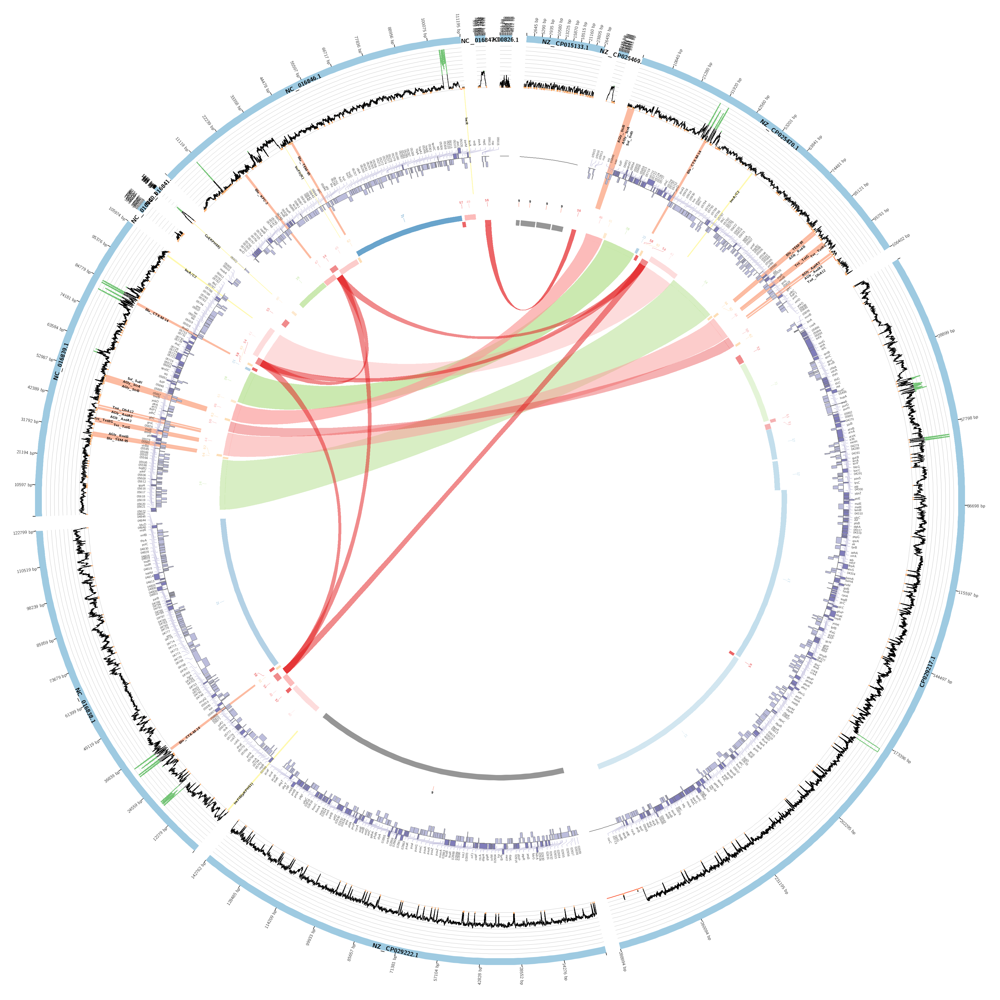

# PlasmidID

This document describes the output produced by the pipeline.

The directories listed below will be created in the analysis directory after the pipeline has finished. All paths are relative to the top-level results directory.

- [PlasmidID](#plasmidid)
  - [Preprocessing](#preprocessing)
  - [Assembly](#assembly)
  - [PlasmidID](#plasmidid-1)
    - [Clustering (mash) results](#clustering-mash-results)
    - [Prokka annotation](#prokka-annotation)
    - [Mapping againts found plasmids](#mapping-againts-found-plasmids)
    - [PlasmidID data for circos](#plasmidid-data-for-circos)
    - [Circos images](#circos-images)
  - [Reconstructed plasmid sequences](#reconstructed-plasmid-sequences)
    - [Summary report](#summary-report)

## Preprocessing

Preprocessing is performed using the assembly template. Check that doc for reference.

## Assembly

Assembly steps are done using the assembly template. Check that doc for reference.

## PlasmidID

[PlasmidID](https://github.com/BU-ISCIII/plasmidID) v1.6.5 is a mapping-based, assembly-assisted plasmid identification tool that analyzes and gives graphic solution for plasmid identification.

PlasmidID is a computational pipeline that maps Illumina reads over plasmid database sequences. The k-mer filtered, most covered sequences are clustered by identity to avoid redundancy and the longest are used as scaffold for plasmid reconstruction. Reads are assembled and annotated by automatic and specific annotation. All information generated from mapping, assembly, annotation and local alignment analyses is gathered and accurately represented in a circular image which allow user to determine plasmidic composition in any bacterial sample.

### Clustering (mash) results

Mash is employed to pinpoint the plasmids present in the sample using a specific database. Subsequently, Mash calculates the genetic distances between these identified plasmids. These distances are then used to group similar plasmids into clusters. From each cluster, the longest plasmid is selected to represent the group in subsequent analyses.

Output files description

`NO_GROUP/kmer`
        - <strong>database.filtered_XX</strong>: Contains identifiers for plasmids identified by Mash that exhibit a distance value greater than a specified threshold (e.g., 0.95).
        - <strong>database.filtered_XX_term.XX.clusters.tab</strong>: A tabulated file listing the clusters of plasmids grouped based on their genetic similarities.
        - <strong>database.filtered_XX_term.XX.representative.fasta</strong>: The FASTA formatted sequence file of the longests plasmids selected as representatives for each cluster.
        - <strong>database.filtered_XX_term.XX.representative.fasta.*.bt2</strong>: Bowtie2 index files for the representative FASTA sequences.
        - <strong>database.filtered_XX_term.fasta</strong>: the FASTA formatted sequences from the plasmids in database.filtered_XX.
        - <strong>database.filtered_XX_term.mash.distances.tab</strong>: Tabulated data of Mash-calculated distances between the filtered plasmid sequences, used for clustering.
        - <strong>database.msh</strong>: The Mash sketch file of the database, which is a compact binary representation of the set of plasmids used for quick distance estimation.
        - <strong>database.screen.tab</strong>: Output file listing the results of the Mash screen operation, which compares the sample against the database to find matching plasmids.

### Prokka annotation

Provided assemblies are automatic annotated using prokka.

Output files description

`NO_GROUP/database`
Prokka output files can be found [here](https://github.com/tseemann/prokka?tab=readme-ov-file#output-files)
        - SAMPLE_NAME.err  
        - SAMPLE_NAME.fna  
        - SAMPLE_NAME.gff
        - SAMPLE_NAME.gff.renamed
        - SAMPLE_NAME.gff.bed: gff in bed format
        - SAMPLE_NAME.gff.reverse.bed: only reverse genes
        - SAMPLE_NAME.gff.forward.bed: only forward genes
        - SAMPLE_NAME.sqn
        - SAMPLE_NAME.txt
        - SAMPLE_NAME.faa
        - SAMPLE_NAME.fsa
        - SAMPLE_NAME.tbl
        - SAMPLE_NAME.ffn
        - SAMPLE_NAME.gbk
        - SAMPLE_NAME.log
        - SAMPLE_NAME.tsv

### Mapping againts found plasmids

Once we have selected the representative plasmids that may be present in the sample, Bowtie2 is employed to map the raw sequencing reads against these plasmid sequences in FASTA format. Plasmids that achieve more than 80% coverage are retained for further analysis. Coverage metrics are calculated and recorded in temporary output files.

Output files description

`NO_GROUP/mapping`
        - <strong>SAMPLE_NAME.coverage</strong>: Contains initial coverage bedgraph data for each plasmid
        - <strong>SAMPLE_NAME.coverage_adapted</strong>: Adjusted coverage mean for each plasmid
        - <strong>SAMPLE_NAME.coverage_adapted_clustered</strong>: adjusted coverage mean filtered with more than 80% coverage.
        - <strong>SAMPLE_NAME.coverage_adapted_clustered_ac</strong>: identificator of filtered plasmids
        - <strong>SAMPLE_NAME.coverage_adapted_clustered_percentage</strong>: coverage data for each plasmid in percentaje (1-value)
        - <strong>SAMPLE_NAME.coverage_adapted_filtered_80</strong>: Lists plasmids with coverage exceeding 80%, selected for subsequent analysis.
        - <strong>SAMPLE_NAME.coverage_adapted_filtered_80_term.fasta</strong>: FASTA formatted file containing sequences of plasmids with more than 80% coverage.
        - <strong>SAMPLE_NAME.coverage_adapted_filtered_80_term.fasta.blast.tmp.*</strong>: Temporary BLAST files for sequences that have passed the 80% coverage threshold, used for further comparative analysis.
        - <strong>SAMPLE_NAME.sorted.bam</strong>: BAM file of aligned reads sorted by coordinates.
        - <strong>SAMPLE_NAME.sorted.bam.bai</strong>: Index file for the sorted BAM file, facilitating faster data retrieval.

### PlasmidID data for circos

Blast is employed to annotate selected databases by comparing them against the assemblies. Additionally, each contig within the assembly is aligned with the identified plasmids. The necessary files for Circos visualization are created in the data folder.

Output files description

`NO_GROUP/SAMPLE_NAME/data`
        - pID_highlights.conf: genes highlights for circos.
        - pID_text_annotation.coordinates: text annotation coordinates for circos.
        - SAMPLE_NAME.bedgraph: bedgraph coverage for each plasmid
        - SAMPLE_NAME.bedgraph_term: filtered bedgraph coverage for each plasmid
        - SAMPLE_NAME.DB.bed: blast result in bed format
        - SAMPLE_NAME.DB.blast: for each annotation database blast result against the assembly
        - SAMPLE_NAME.DB.coordinates: blast result with the coordinates needed for the circos image
        - SAMPLE_NAME.fna.blast.tmp.*: blast tmp database files
        - SAMPLE_NAME.gff.forward.coordinates: gff coordinates for forward genes for annotation track
        - SAMPLE_NAME.gff.reverse.coordinates: gff coordinates for reverse genes for annotation track
        - SAMPLE_NAME.karyotype_individual.txt: karyotype template for each plasmid individual image
        - SAMPLE_NAME.karyotype_summary.txt: karyotype circos file for summary image
        - SAMPLE_NAME.plasmids.bed: blast result plasmids in bed format.
        - SAMPLE_NAME.plasmids.blast: blast result contigs against identified plasmids.
        - SAMPLE_NAME.plasmids.blast.links: blast result for links for contigs that match different plasmids.
        - SAMPLE_NAME.plasmids.complete: complete track information for citcos
        - SAMPLE_NAME.plasmids.links: links for contigs that match different plasmids.

### Circos images

Circos is used for creating one image for each identified plasmid and a summary image with all the plasmids identified in one figure. A manual for image interpretation can be found [here](https://github.com/BU-ISCIII/plasmidID/wiki/Understanding-the-image:-track-by-track) and a manual about how to select the correct plasmid can be found [here](https://github.com/BU-ISCIII/plasmidID/wiki/How-to-chose-the-right-plasmids).

Output files description

`NO_GROUP/images`

- SAMPLE_NAME_PLASMID_individual.circos.conf: circos conf file used for generating the individual image
- SAMPLE_NAME_PLASMID.png: circos image for individual plasmidID
- SAMPLE_NAME_summary.circos.conf: circos conf file used for genering the summary image
- SAMPLE_NAME_summary.png: summary image

## Reconstructed plasmid sequences

A multifasta file is created for each plasmid including all the contig sequences that have matched the identified contig.

Output files description

`NO_GROUP/fasta_files`

- PLASMID_term.fasta: multifasta file for each plasmid identified in the sample.

### Summary report

A summary report consolidating all samples in the analysis is created.

Output files description

`NO_GROUP`

- `NO_GROUP_final_results.html`: report with same info as table below that can be viewed using chrome.
- `NO_GROUP_final_results.tab`: plasmid info for each sample.

