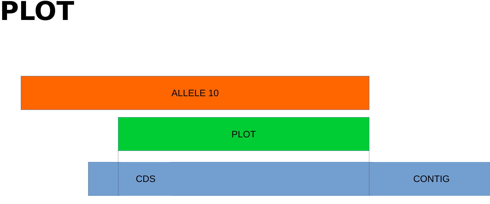
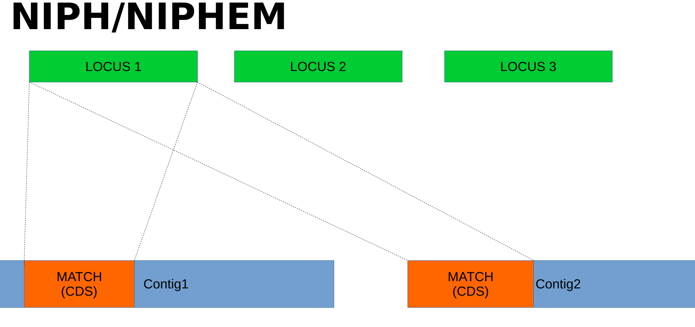
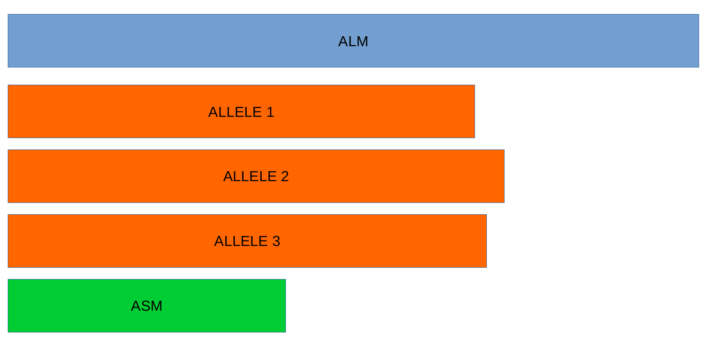

# Output description for cgMLST/wgMLST with ChewBBACA

## Pipeline description

MLST service performs Multi-Locus Sequence Typing of the samples with the _de novo_ assembly genomes of the samples. It uses [ChewBBACA](https://chewbbaca.readthedocs.io/en/latest/index.html) to generate the schemas (if necessary) and perform the allele calling, and [GrapeTree](https://enterobase.readthedocs.io/en/latest/grapetree/grapetree-about.html) to generate the minimun spanning tree.

### Pipeline overview

- ChewBBACA - v3.3.3 - Schema generation and allele calling
- GRapeTree - v2.2 - Minimum spanning tree

> [!WARNING]
> Needs the _de novo_ assembly of the samples to be performed.

## Output directory

- `02-chewbbaca`: Results from ChewBBACA analysis:
  - `prep_schema`: Schema files prepared for chewbbaca.
  - `analyze_schema/schema_report.html`: HTML report with the evaluation of the schema used for the analysis.
  - `allele_calling`:
    - `cds_coordinates.tsv`: Contains the coordinates (genome unique identifier, contig identifier, start position, stop position, protein identifier attributed by chewBBACA, and coding strand (chewBBACA<=3.2.0 assigns 1 to the forward strand and 0 to the reverse strand and chewBBACA>=3.3.0 assigns 1 and -1 to the forward and reverse strands, respectively)) of the CDSs identified in each genome.
    - `loci_summary_stats.tsv`: Contains the classification type counts (EXC, INF, PLOT3, PLOT5, LOTSC, NIPH, NIPHEM, ALM, ASM, PAMA, LNF) and the total number of classified CDSs (non-LNF) per locus.
    - `paralogous_counts.tsv`: Contains the list of paralogous loci and the number of times those loci matched a CDS that was also similar to other loci in the schema.
    - `results_alleles.tsv`: Contains the allelic profiles determined for the input samples. The first column has the identifiers of the genome assemblies for which the allele call was performed. The remaining columns contain the allele call data for loci present in the schema, with the column headers being the locus identifiers. The INF- prefix in the allelic number indicates that such allele was newly inferred in that genome, and the number following the prefix is the ID attributed to such allele. For the PLOT classification, in the allelic profile output, a locus can be classified as PLOT5 or PLOT3 depending whether the CDS in the genome under analysis matching the schema locus is located in the 5' end or 3' end (respectively) of the contig. All other annotations are identical to what was described above.
    - `results_statistics.tsv`: Contains the classification type counts (EXC, INF, PLOT3, PLOT5, LOTSC, NIPH, NIPHEM, ALM, ASM, PAMA, LNF), the total number of invalid CDSs, the total number of classified CDSs (non-LNF) and the total number of predicted CDSs per genome. The column headers stand for:
      - EXC - EXaCt matches (100% DNA identity) with previously identified alleles.
      - INF - INFerred new alleles that had no exact match in the schema but are highly similar to loci in the schema. The INF- prefix in the allele identifier indicates that such allele was newly inferred in that genome, and the number following the prefix is the allele identifier attributed to such allele. Inferred alleles are added to the FASTA file of the locus they share high similarity with.
      - LNF - Locus Not Found. No alleles were found for the number of loci in the schema shown. This means that, for those loci, there were no BLAST hits or they were not within the BSR threshold for allele assignment.
      - PLNF - Probable Locus Not Found. Attributed when a locus is not found during execution modes 1, 2 and 3. Those modes do not perform the complete analysis, that is only performed in mode 4 (default), and the distinct classification indicates that a more thorough analysis might have found a match for the loci that were not found.
      - PLOT3/PLOT5 - Possible Locus On the Tip of the query genome contigs (see image below). A locus is classified as PLOT when the CDS of the query genome has a BLAST hit with a known larger allele that covers the CDS sequence entirely and the unaligned regions of the larger allele exceed one of the query genome contigs ends (a locus can be classified as PLOT5 or PLOT3 depending on whether the CDS in the genome under analysis matching the schema locus is located in the 5’ end or 3’ end (respectively) of the contig). This could be an artifact caused by genome fragmentation resulting in a shorter CDS prediction by Prodigal. To avoid locus misclassification, loci in such situations are classified as PLOT.
      - LOTSC - A locus is classified as LOTSC when the contig of the query genome is smaller than the matched allele.
      - NIPH - Non-Informative Paralogous Hit (see image below). When ≥2 CDSs in the query genome match one locus in the schema with a BSR > 0.6, that locus is classified as NIPH. This suggests that such locus can have paralogous (or orthologous) loci in the query genome and should be removed from the analysis due to the potential uncertainty in allele assignment (for example, due to the presence of multiple copies of the same mobile genetic element (MGE) or as a consequence of gene duplication followed by pseudogenization). A high number of NIPH may also indicate a poorly assembled genome due to a high number of smaller contigs which result in partial CDS predictions. These partial CDSs may contain conserved domains that match multiple loci.
      - NIPHEM - similar to the NIPH classification, but specifically referring to exact matches. Whenever several CDSs from the same genome match a single or multiple alleles of the same locus with 100% DNA similarity during the first DNA sequence comparison, the NIPHEM tag is attributed.
      - PAMA - PAralogous MAtch. Attributed to CDSs that are highly similar to more than one locus. This type of classification allows the identification of groups of similar loci in the schema that are classified as paralogous loci and listed in the paralogous_counts.tsv and paralogous_loci.tsv files.
      - ALM - Alleles 20% Larger than the length Mode of the distribution of the matched loci (CDS length > (locus length mode + locus length mode * 0.2)) (see image below). This determination is based on the currently identified set of alleles for a given locus. It is important to remember that, although infrequently, the mode may change as more alleles for a given locus are called and added to a schema.
      - ASM - similar to ALM but for Alleles 20% Smaller than the length Mode distribution of the matched loci (CDS length < (locus length mode - locus length mode * 0.2)). As with ALMs it is important to remember that, although infrequently, the mode may change as more alleles for a given locus are called and added to a schema.

    - `invalid_cds.txt`: Contains the list of alleles predicted by Prodigal that were excluded based on the minimum sequence size value and presence of ambiguous bases.
    - `logging_info.txt`: Contains summary information about the allele calling process.
    - `paralogous_loci.tsv`: Contains the sets of paralogous loci identified per genome (genome identifier, identifiers of the paralogous loci and the coordinates of the CDS that is similar to the group of paralogous loci).
    - `results_contigsInfo.tsv`: Contains the loci coordinates in the genomes analyzed. The first column contains the identifier of the genome used in the allele calling and the other columns (with loci names in the headers) the locus coordinate information or the classification attributed by chewBBACA if it was not an exact match or inferred allele.
  - `allele_calling_evaluation`:
    - `allelecall_report.html`: A HTML report, that contains the following components:
      - A table with the total number of samples, total number of loci, total number of coding sequences (CDSs) extracted from the samples, total number of CDSs classified and totals per classification type.
      - A tab panel with stacked bar charts for the classification type counts per sample and per locus.
      - A tab panel with detailed sample and locus statistics.
      - If a TSV file with annotations is provided to the --annotations parameter, the report will also include a table with the provided annotations. Otherwise, it will display a warning informing that no annotations were provided.
      - A Heatmap chart representing the loci presence-absence matrix for all samples in the dataset.
      - A Heatmap chart representing the allelic distance matrix for all samples in the dataset.
      - A tree drawn with Phylocanvas.gl based on the Neighbor-Joining (NJ) tree computed by FastTree.
    - `cgMLST_MSA.fasta`: contains the MSA of the core loci. For each locus in the core genome, the alleles found in all samples are translated and aligned with MAFFT. The alignment files are concatenated to generate the full alignment.
    - `cgMLST_profiles.tsv`: contains the allelic profiles for the set of core loci.
    - `distance_matrix_symmetric.tsv`: contains the symmetric distance matrix. The distances are computed by determining the number of allelic differences from the set of core loci (shared by 100% of the samples) between each pair of samples.
    - `masked_profiles.tsv`: contains the masked allelic profiles (results from masking the allelic profiles in the results_alleles.tsv file generated by the AlleleCall module).
    - `presence_absence.tsv`: Contains the loci presence-absence matrix.
    - `report_bundle.js`: A JavaScript bundle file necessary to visualize the report.

> [!NOTE]
> For more information, see the [ChewBBACA's documentation](https://chewbbaca.readthedocs.io/en/latest/index.html) in the `User Guide` secton

- `03-grapetree`:
  - `tree.svg`: Minimum Spannig Tree plot in SVG (Scalable Vector Graphics) format. Branches longer than = 700 are shown shortenned.
  - `tree.nwk`: Newick tree from the Minimum Spannig Tree.
